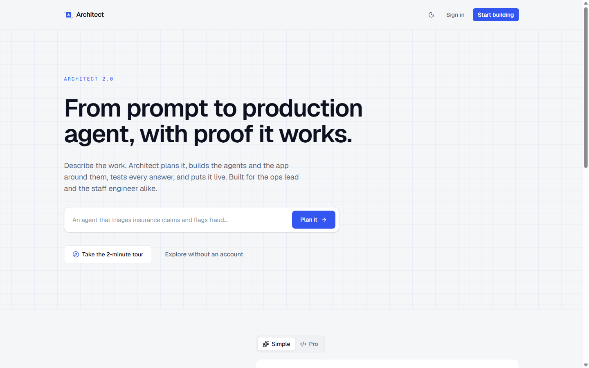
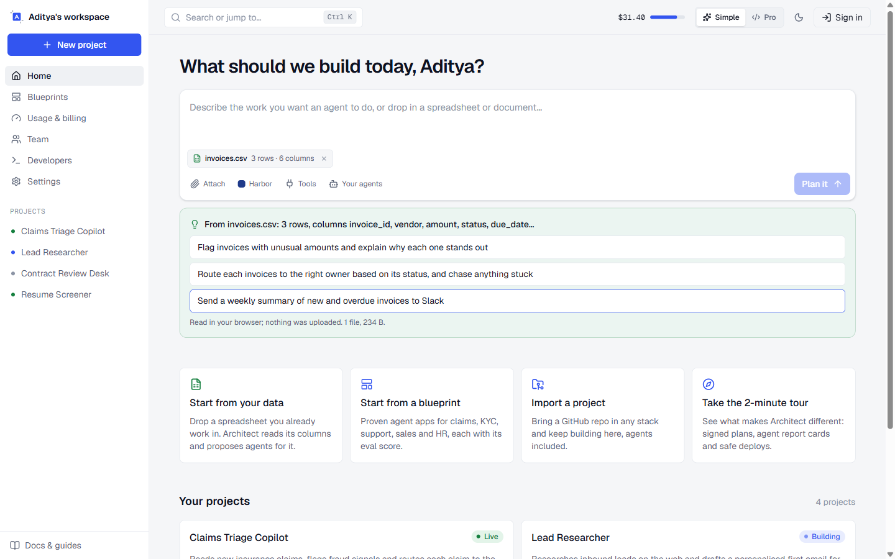
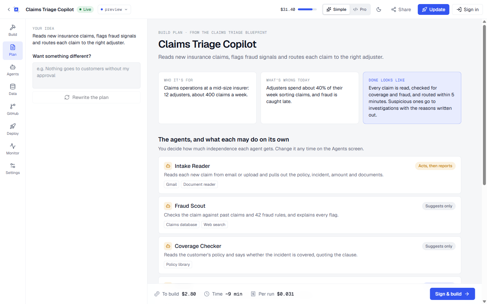
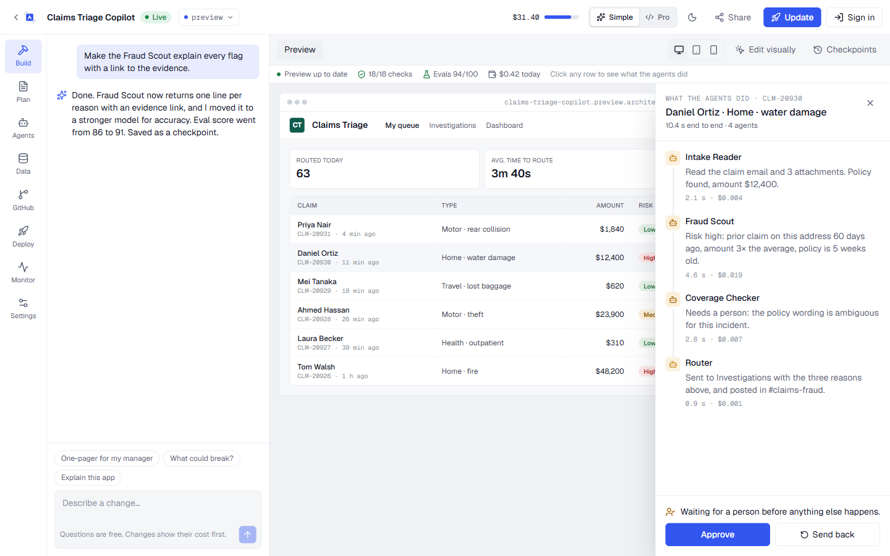
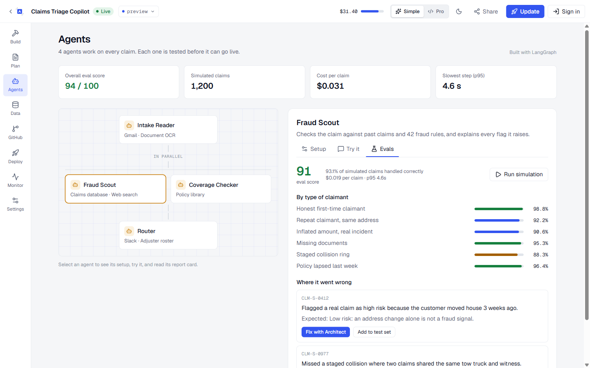
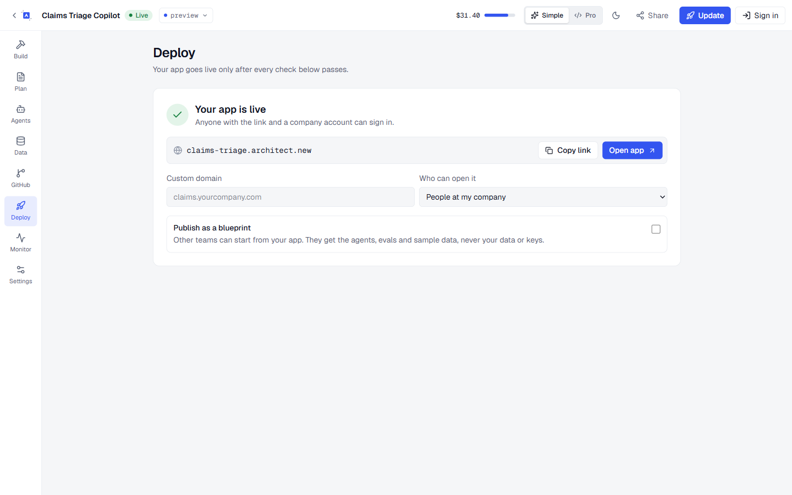
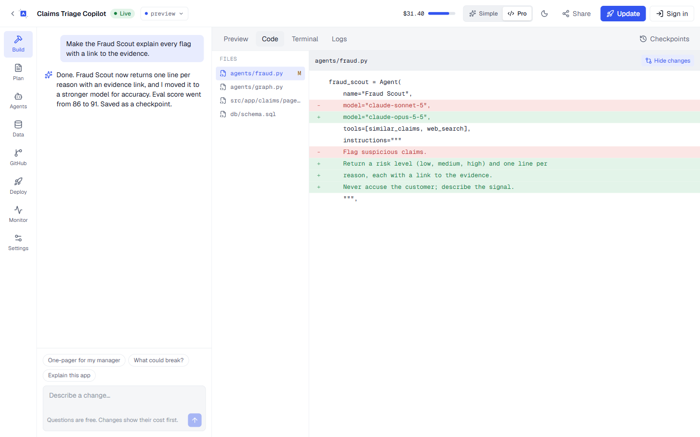

# Architect 2.0

**From prompt to production agent, with proof it works.**

A concept for the next version of [Architect](https://architect.new), built for the Lyzr AI Technical PM assignment.

**Live:** https://architect-2-mauve.vercel.app · **Fastest way in:** open the site and click **Take the 2-minute tour**, or press **Ctrl+K** anywhere.



## The problem

Every vibe-coding tool helps you *build an app*, and every coding agent helps you *write code*. None of them tell you whether the AI agents inside your app actually work, and users keep hitting the same walls: credits that vanish in fix-it loops, apps that "worked in the demo", agents that damage production, and developers who lose control of their code.

Lyzr already owns the answer (production blueprints and a simulation engine that runs thousands of tests per agent) but today it lives outside the builder. Architect 2.0 puts it at the centre.

## What's different

| Users struggle with | Architect 2.0 |
|---|---|
| Not knowing what to build | **Start from your data**: drop a spreadsheet you already use; Architect reads its columns in the browser and proposes agents for it |
| Vague prompts that burn credits | **Sign a plan, not a prompt**: a build contract with what each agent may do on its own, what could go wrong and what stops it, and a computed cost |
| "It worked in the demo" | **Agent report cards**: eval score, 1,200 simulated cases by type, failure examples with one-click fixes, traces |
| Black-box builds | **Show the work**: a live build timeline, a checkpoint on every step, a health bar over the preview, and a record-by-record view of what every agent did |
| Surprise bills | **Every change shows its cost first**. Questions and documents are free |
| Agents damaging production | Preview / staging / production, approval gates, and a deploy checklist (tests, security, secrets, evals, spending cap) |
| Developers losing control | **One project, two lenses**: the same screens in Simple or Pro (code, diffs, terminal, traces, PRs), a command palette, a CLI and an MCP server |

## A 2-minute walkthrough

| | |
|---|---|
|  | **1. Start from your data.** Drop a CSV; Architect finds the columns and suggests agents. Or describe the idea, pick a theme, the tools agents may use, and existing agents to reuse. |
|  | **2. Sign the plan.** Three questions, then a contract: outcome, each agent's autonomy, risks with safeguards, cost to build and per run. Rewrite it in plain words, then Sign & build. |
|  | **3. Watch it built.** Timeline with checkpoints, a health bar, and a clickable preview: open any record to see what each agent did and approve or send back. Quick asks write a one-pager for your manager or list what could break. |
|  | **4. Proof the agents work.** Agent graph, setup, a test chat, and a report card per agent. Pro adds the framework picker (Lyzr, LangGraph, CrewAI, OpenAI Agents SDK, Claude Agent SDK, GitAgent) and traces. |
|  | **5. Go live safely.** Five checks must pass. Then the live URL, custom domain, access, and publishing as a blueprint for other teams. |
|  | **Pro view.** The same project with code, the last change as a diff, terminal and logs. GitHub gets branch-per-task pull requests. |

Also in the product: GitHub connect and PRs, Monitor (plain-language issues with one-click fixes), Data (tables, knowledge files, SQL console in Pro), project settings (tools, MCP servers, secrets vault, people), Share dialog, environment switcher, Blueprints, Usage with estimate vs actual, Team with roles and audit log, Developers (CLI, MCP config, API keys), and repo import.

## What actually works

- **Sign-in** with Supabase Auth: GitHub OAuth and passwordless email links, session refresh in `src/proxy.ts`, OAuth callback with clear error reporting.
- **Database** with row-level security: projects created from the home prompt and onboarding choices are saved to Postgres; each user only sees their own rows (`supabase/schema.sql`).
- **Plan writing** at `/api/plan`: Claude Opus 5 with structured JSON output when `ANTHROPIC_API_KEY` is set, a keyword-based template planner otherwise. Costs are computed from each agent's model, never guessed by the model.
- **File reading** in the browser: CSV/TSV columns and row counts, text documents; nothing is uploaded.
- **Command palette** (Ctrl+K), **guided tour**, **themes** (presets or your own brand), Simple/Pro and light/dark, all remembered per browser.
- **Demo mode**: without Supabase settings the app runs on seeded data, so every flow works without an account.

Builds, evals, deploys and GitHub actions are scripted flows that show the intended product behaviour.

## Stack

Next.js 16 (App Router, Server Actions) · React 19 · TypeScript · Tailwind CSS 4 · Supabase (Auth + Postgres) · Anthropic TypeScript SDK · lucide-react · Vercel

## Run it locally

```bash
npm install
cp .env.example .env.local   # optional: add Supabase and Anthropic keys
npm run dev
```

For real sign-in, create a Supabase project, run `supabase/schema.sql` in its SQL editor, and set `NEXT_PUBLIC_SUPABASE_URL` and `NEXT_PUBLIC_SUPABASE_ANON_KEY`. For Claude-written plans, set `ANTHROPIC_API_KEY`.

## Project map

```
src/app/                    routes: landing, login, onboarding, (workspace)/*, p/[id]/*
src/app/api/plan/route.ts   writes the build plan (Claude or template)
src/app/actions.ts          server actions: create project, save profile, sign out
src/app/auth/callback       OAuth / magic-link code exchange
src/proxy.ts                keeps the Supabase session fresh
src/components/             shells, plan/build/agents/deploy views, dialogs, palette, tour
src/lib/plan.ts             plan shape, questions, cost maths, template planner
src/lib/agent-report.ts     turns a plan into the Agents report card
src/lib/attachments.ts      reads CSVs and documents in the browser
src/lib/supabase/           server and browser clients (null in demo mode)
supabase/schema.sql         tables and row-level security policies
```
