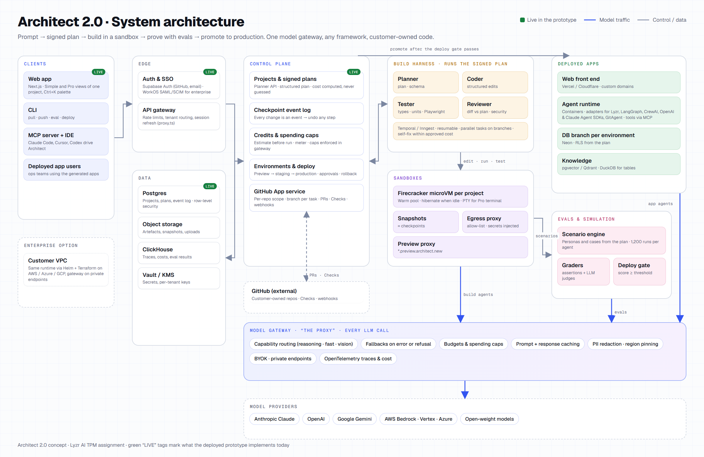

# Architect 2.0: Architecture

How Architect 2.0 would be built for production, and which parts this prototype already implements.

## Principles that drive the design

1. **One project, two views.** Simple and Pro are two renderings of one source of truth (plan, code, agent config, data), never two products. Every component stores state that both views can read.
2. **Nothing runs unsigned or unpriced.** Every build or change starts from a signed plan with a cost estimate; the model gateway enforces spending caps at runtime.
3. **Agents are proven before they ship.** Evals and simulation are first-class services that gate deploys.
4. **Untrusted code only runs in isolation.** Generated code, imported repos and user agents run in per-project microVMs, never on shared hosts.
5. **Model- and framework-agnostic.** Every model call goes through one gateway, and every agent framework sits behind one adapter interface.
6. **The customer owns the output.** Real code in their GitHub, portable agents, and a VPC deployment option for enterprise.

## System overview

| Layer | Responsibility | Proposed technology |
|---|---|---|
| Clients | Web app (Simple/Pro), CLI, MCP server, IDE extension | Next.js + React, Node CLI, MCP (streamable HTTP) |
| Edge | Auth, SSO, rate limits, tenant routing | Vercel / Cloudflare edge, Supabase Auth or WorkOS for SAML/SCIM |
| Control plane | Projects, plans, checkpoints, credits, environments, deploy orchestration, GitHub App | TypeScript services on Postgres, event log per project, Redis |
| Build harness | Turns a signed plan into a working app: plan → code → test → review loop | Claude Agent SDK style harness on durable workflows (Temporal or Inngest) |
| Sandboxes | Isolated dev environments per project session with live preview | Firecracker microVMs (E2B or self-hosted on Fly Machines), snapshot per checkpoint |
| Model gateway ("the proxy") | Every LLM call: routing, fallbacks, budgets, caching, redaction, tracing | Own gateway (LiteLLM-compatible API) with OpenTelemetry |
| Agent runtime | Runs the user's agents in their deployed app, any framework | Containers with framework adapters, MCP for tools, A2A for agent-to-agent |
| Evals and simulation | Personas, scenarios, graders, deploy gates | Lyzr simulation engine on a job queue, results in ClickHouse |
| Deploy | Frontends, agent backends, per-environment databases, domains | Vercel/Cloudflare for web, Cloud Run/Fly/Kubernetes for agents, Neon branches per environment |
| Observability | Traces, costs, issues, auto-fix suggestions | OpenTelemetry → ClickHouse (Langfuse-compatible views) |
| Data | Metadata, artefacts, secrets, analytics | Postgres, S3-compatible storage, Vault/KMS, ClickHouse, pgvector/Qdrant |

## Key decisions

### 1. Sandboxing

- **One Firecracker microVM per project session**, created from a warm pool so a preview starts in about a second. MicroVMs give kernel-level isolation, which containers alone don't, and that matters because we run model-written code and imported repos.
- **Checkpoints are filesystem snapshots** plus a row in the project's event log. "Restore" boots a VM from that snapshot; nothing is ever overwritten, so undo is always safe.
- **Network egress is deny-by-default** with an allow-list per project (package registries, the model gateway, connected tools). Secrets are never written into the VM: they are injected by an egress proxy on the way out, so a prompt-injected agent cannot read them.
- **Preview URLs** (`<project>.preview.architect.new`) go through a sandbox proxy that authenticates the viewer and forwards to the dev server port.
- **Idle VMs hibernate** after 10 minutes (snapshot and stop), which keeps cost proportional to active use and removes the "sandbox died while I was away" failure.
- **Pro view terminal** is a PTY into the same VM over WebSocket, so what developers see is exactly what the build agent sees.

### 2. The agent harness (how Architect builds apps)

- **Plan first.** The planner turns the idea, attached data and three answers into a structured plan (JSON schema): agents, autonomy levels, risks, screens, data. Costs are computed from the plan by the control plane, never guessed by a model. The user signs the plan; the signed version is the contract the build must satisfy.
- **A small team of role agents** runs inside a durable workflow: Architect (file plan and schema), Coder (edits files through a structured edit tool), Tester (runs type-checks, unit tests and a real-browser test with Playwright, and takes screenshots), and Reviewer (checks the diff against the plan and security rules). Each step streams progress to the UI and ends in a checkpoint.
- **Durable execution** (Temporal or Inngest) makes long builds resumable after crashes and lets many tasks run in parallel on separate branches without clobbering each other.
- **Self-healing with a budget.** Failing tests go back to the Coder with the error, capped by attempts and by the change's approved cost. Failed builds and self-fix loops are not billed to the user, which aligns our incentives with theirs.
- **Tools are MCP servers**, the same ones users connect for their apps, so the harness and user agents share one tool ecosystem.

### 3. The proxy: one model gateway for everything

Every model call from the harness, from users' deployed agents, and from the eval engine goes through the gateway:

- **Routing and fallbacks** by task and by refusal: judgement-heavy steps to the strongest model, routing and extraction to fast cheap models, with automatic fallback when a provider errors or declines.
- **Budgets enforced here**, not in the UI: per project, per environment and per tenant. When a spending cap is hit, runs pause instead of overspending.
- **Prompt caching and response caching** where safe, which is the single biggest cost lever for agent loops.
- **Safety and compliance:** PII redaction before logging, per-tenant data residency (region pinning), and zero-retention providers for regulated customers.
- **Bring your own key** and private endpoints (Bedrock, Vertex, Azure) per tenant, without code changes in apps.
- **Every call is traced** with OpenTelemetry (tokens, latency, cost, model), which feeds usage, the Monitor screen and per-agent cost reports.

### 4. Model and framework agnosticism

- **Models:** apps and agents reference *capabilities* ("reasoning", "fast", "vision"), not model IDs. The gateway maps capabilities to models per tenant, so upgrading a model is a config change plus an eval run, not a code change.
- **Frameworks:** a thin **Agent Adapter interface** (`run`, `stream`, `tools`, `memory`, `trace`) wraps Lyzr agents, LangGraph, CrewAI, OpenAI Agents SDK, Claude Agent SDK and GitAgent. Evals, traces, deploys and the Agents screen work the same for all of them.
- **Portability:** agent definitions are stored as files in the repo (GitAgent-style `agent.yaml`, rules, skills), so the customer can leave with everything.

### 5. GitHub integration

- **A GitHub App with per-repo, fine-grained permissions** (not OAuth tokens with account-wide access). Installation is scoped to the repos the user picks.
- **Simple view:** every checkpoint is a commit on the default branch, so the repo always mirrors the app.
- **Pro view:** a branch per task and a pull request per change. Architect posts **GitHub Checks** for build, tests, security scan and agent evals, so eval regressions block merges like failing tests do.
- **Two-way sync** through webhooks: commits pushed from a laptop or from Claude Code are pulled into the sandbox and re-verified.
- **Import any repo:** clone into a sandbox, detect the stack and existing agents, run the project's own tests, then propose a first plan (for example "add evals to your 3 CrewAI agents").

### 6. Knowledge and data

- **Spreadsheets** become tables (Postgres for app data, DuckDB for ad-hoc analysis by analyst agents). **Documents** are chunked and embedded into pgvector (or Qdrant at scale) with citations back to the source.
- **Each app gets its own database per environment** (Neon branches: preview, staging, production), with row-level security generated from the plan. Preview never touches production data.

### 7. Evals and simulation (the differentiator)

- From the signed plan, the engine generates **personas and scenarios** (typical case, missing details, edge cases, adversarial inputs), runs them against the agents in the sandbox, and grades with deterministic assertions plus LLM judges.
- Results roll up to a **report card per agent** (pass rate by case type, failures, cost, latency). The **deploy gate** requires scores above the threshold the user set.
- Failed cases become **regression tests** ("Add to test set") that run on every future change and in GitHub Checks.

### 8. Deployment

- **Web front end** to Vercel or Cloudflare; **agent backend** as containers on Cloud Run, Fly or Kubernetes; **database** as a Neon branch per environment; **secrets** in Vault/KMS, injected at runtime.
- **Promotion, not rebuilds:** the exact artefact tested in staging is promoted to production after the checklist passes (tests, security scan, secrets, evals, spending cap) and, where configured, an admin approves. Rollback re-points traffic to the previous artefact in seconds.
- **Enterprise VPC:** the same runtime ships as a Helm chart and Terraform module into the customer's AWS, Azure or GCP account, with the model gateway pointing at their private endpoints.

### 9. Scaling and reliability

- The control plane is **stateless and horizontally scaled**; long work lives in the workflow engine and job queues, not in web requests.
- **Warm sandbox pools per region** and hibernation keep start-up fast and idle cost near zero; per-tenant quotas protect shared capacity.
- **Simulation runs are batch jobs** that scale out on spot capacity and use the gateway's batch APIs at lower cost.
- **Multi-region:** tenant data pinned to a home region; the gateway routes to in-region model endpoints.
- **Tenant isolation** at every layer: VM per project, database per app, row-level security, per-tenant encryption keys, and an audit log of every deploy, secret change and agent edit.

## What this prototype implements today

| Area | In the prototype |
|---|---|
| Web app, Simple/Pro, all screens | Next.js 16 App Router, React 19, Tailwind 4, deployed on Vercel |
| Auth | Supabase Auth: GitHub OAuth and email magic links, session refresh in `src/proxy.ts` |
| Data | Supabase Postgres with row-level security (`supabase/schema.sql`): projects and profiles |
| Planner | `/api/plan`: Claude Opus 5 with structured JSON output when a key is set, a template planner otherwise; costs computed in code |
| Knowledge intake | CSV/TSV and text files read in the browser; agent ideas from real columns |
| Everything else | Build harness, sandboxes, gateway, evals, GitHub App and deploys are simulated flows that show the intended behaviour |
